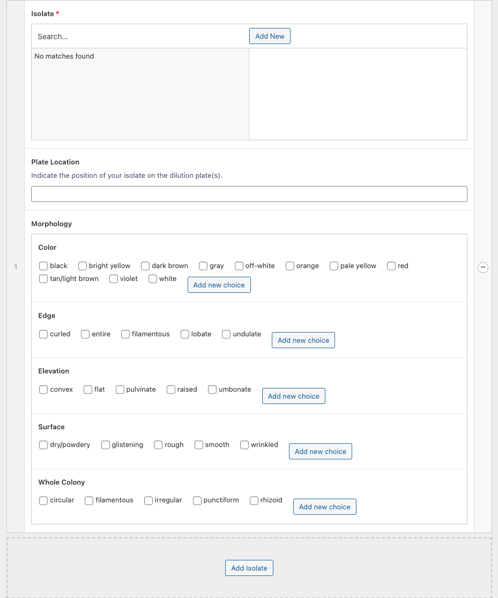

# Serial Dilution Plate

Serial Dilution Plates are the first stage of the Tiny Earth research flow in which students identify Isolates of their own. To create an entry of this type, visit "My Entries," locate the Environmental Sample that was diluted to create the Serial Dilution Plate, and click "Add dilution" under that Sample.

!!! tip "Recommended: Create Isolates First"
    This entry type refers to both Environmental Samples and Isolates. Because it records information about the position, morphology, and other details of an isolate on a plate, it may be simpler to [create those Isolates first](isolate.md), then return here to record information about them in relation to this plate.

    And if you are working in a team and have coauthors to add to your Isolates, doing things in this order is *highly* recommended, as it will allow your teammates to track the same Isolates across your different research activities.

    So, before you begin to record this plate, first create an Isolate entry for each Isolate you wish to track on this plate. Creating an Isolate entry involves only three pieces of information: a nickname for the Isolate, the date it was first observed, and the Sample it originated from. Moreover, if you have coauthors to add to your Isolates, add them now.

    Then once you've completed and saved your Isolates, return here.

!!! tip "Recommended: Take a Picture"
    For entry types like this one that record the position of an Isolate on a plate, it is recommended that you take a clear photo of your plate, then mark up the image as needed in simple photo editing software, such Microsoft Paint, Google Slides, or <https://jspaint.app/>.
    
    For each Isolate on the plate you are tracking, clearly number its position on the plate with a high-contrast font.

    Then, when you record your information for this entry, upload the image under "Additional Notes" and reference the position numbers as needed when recording information about Isolates on this plate.

## Use This Entry to Record

- Conditions under which your serial dilution plates were cultivated
- Isolates that were identified on those plates
- Morphologies of those isolates under those conditions

## Required Information

- **Date:** The date the plate was first created
- **Sample:** The Environmental Sample that was used to create this plate. This field is automatically populated for you if you click "Add dilution" under an existing sample. If a teammate created the Environmental Sample entry, make sure that they have added you as a co-author so you may refer to it on your plates and isolates
- **Isolate Selection:** Click the "Add Isolate" button to link an isolate to this entry. See the "Isolate Selection Interface" selection below for more information

## Optional Information

- **Nickname:** When you have several Serial Dilution Plates, it may be useful to give them short names to help distinguish them. Please follow your instructor's guidelines on how to name entries meaningfully
- **Media Used** and **Concentration of Media Used:** The base media used to cultivate the plate and its concentration. For example, commonly when the Media Used is TSA, the Concentration is 10%. Confirm with your instructor the concentration of your media
!!! warning "This is not the concentration of the dilution"
    This field and the next one are *not* used for recording the concentrations from the serial dilution *process* (sequentially adding your sample to a sterile dilution buffer), but instead to record the concentration of the media and its additives on the *plate* (plating and incubating). The concentrations from the serial dilution process are used to compute the CFU/g field, described below.
- **Additives** and **Concentration of Additives:** Additives to the media, such as antifungals, and their concentration (in ug/mL). Confirm with your instructor the additives to your media and their concentration
- **Media Modification:** A description of other modifications you made to your media, such as adding honey, essential oils, cinnamon, or so on. Many students like to test the effect of such treatments on their isolates -- that treatment would be recorded here
- **Incubation Temperature** and **Duration**: The temperature (in Celsius) and the duration (in Hours) that the plate was incubated
- **Dilution Buffer:** The sterile buffered used during the serial dilution process
- **CFU/g:** Colony Forming Units, which can be [calculated following the method in this video](https://www.youtube.com/watch?v=s0rmg8tOD-A&t=340s). This field has two input boxes, one labeled "Colonies" and one labeled "10x^." If, for example, the CFU/g is 8000, enter "8" under "Colonies" and "3" under "x10^."

## Isolate Selection Interface

After completing the rest of the fields for your plate, it is time to link the plate's entry to the Isolates you are tracking on it. For simplicity, it is recommended that you [create entries for these Isolates separately](isolate.md) before linking them here.

First, use the **"Search..."** field to locate an Isolate by its nickname and click its name in the search results. *You do not need to press the "Add New" button if you already created the Isolate separately.*

Second, use the **Plate Location** field to indicate the position of the isolate on the plate. For simplicity, it is recommended that you upload a labeled photo of your plate to your plate's Additional Notes, so you can refer to the numerical position of the isolate at this step.

Third, use the **Morphology** fields to indicate how the Isolate appears on this plate. Keep in mind that Isolates can appear differently under different culture conditions, so it is important to record this information accurately for each plate they are cultivated on throughout your research process!

Fourth, if you have another Isolate to record, press the "Add Isolate" button and repeat this process.

!!! tip "Deleting Extra Rows"
    If you accidentally press the "Add Isolate" button too many times, you can remove unnecessary rows by pressing the small "(-)" button next to the row on the far right edge of the Isolate Selection table.

## Suggestions for "Additional Notes"

- `TODO`