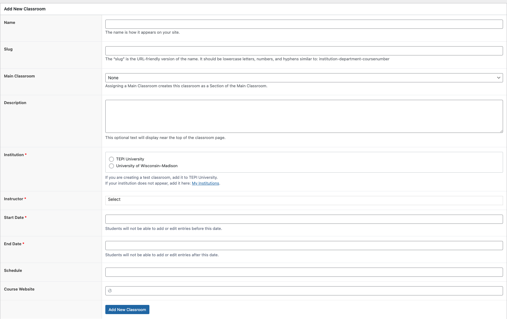

# Create Your First Classroom

When you log in as an instructor, you will see a [Manage Classes](https://discovery.tinyearth.wisc.edu/classroom-management/) tab in your navigation bar that is not available to student accounts.

To create your first classroom:

1. Visit [Manage Classes](https://discovery.tinyearth.wisc.edu/classroom-management/)
2. Click "+ Create a new classroom." You will be taken to an interface for managing the metadata (course names, dates, etc.) for all classes you are an instructor on. At this point, none should be listed so far
3. Click "Add New Classroom." A form should appear on the page for entering your classroom's data
4. Complete the form, leaving "Main Classroom" set to "None." If you have co-instructors or course observers, add them to the "Instructors" field. Please use a sensible, unique slug, such as "uwmadison-plpath-145-sp23" so that your course is easily identifiable among all other classrooms in the database
5. Once you are satisfied with your classroom's information, click the "Add New Classroom" button at the bottom of the form. The classroom will now appear listed at the bottom of the page
6. You can return to this page at any time to edit any of your classes' data

!!! warning "Classrooms Can Only be Deleted by Admins"
    To prevent classrooms from being deleted by accident that may contain troves of student discovery data, instructors are not able to delete classrooms, even those they create.

    If you created a classroom but want it removed entirely, use the [Report Issue](https://discovery.tinyearth.wisc.edu/report-issue) link at the bottom of every database page.