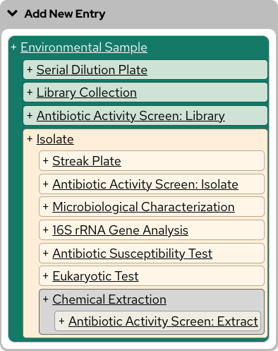
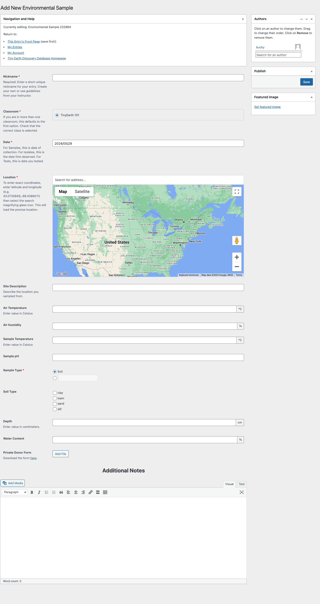

# Add Your First Entry

To add your first entry, visit <https://discovery.tinyearth.wisc.edu/my-entries/>.

Click the grey "Add New Entry" box to expand the available options.

The first entry you'll add is your Environmental Sample, to represent where you collected your sample and under what conditions.

Click "+ Environmental Sample" inside the "Add New Entry" box.

!!! warning "Redirected Error"
    If you receive an error saying you were "Redirected," the most likely cause is that your instructor has not added you to their classroom yet. To check your classroom status, visit <https://discovery.tinyearth.wisc.edu/my-account/classrooms/>.
    
    Once you have been added to a class you may continue.

Whenever you create or edit your database entries, you'll be taken to a page with a form for recording your information.

To create an Environmental Sample entry, at minimum you will need to record:

- A nickname for the sample
- The date it was collected
- The exact location it was collected
- And the sample type, such as soil, water, or so on

If your sample was collected from privately owned land, you will also need to attach a completed Private Donor Form.

If you have other information about the conditions the sample was collected under, such as air temperature and humidity, record that as well.

You may also use the Additional Notes space to add any other information not covered by the form, attach images, describe procedures, and so on.

Once you are done recording your Environmental Sample's information, click "Save" toward the top right of the form.

You've just created your first entry in the database!

Science is a collaborative effort, and students in Tiny Earth classes often work together, so next let's talk about adding coauthors to your entries!