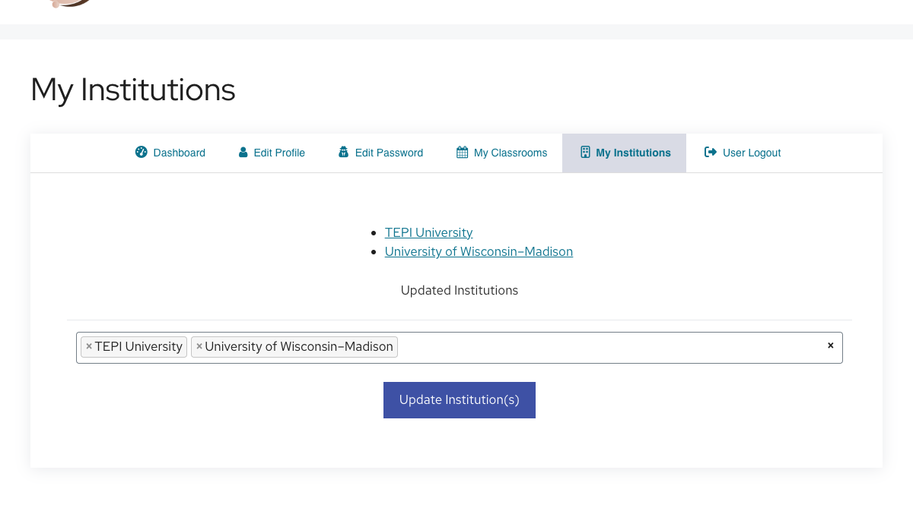

# Setting Up Your Instructor Account

The first time you login with your instructor account, before you create your first class, you will need to [set your institution(s)](https://discovery.tinyearth.wisc.edu/my-account/my-institutions/).

All TEPI institutions should be listed already, but if yours is not, please contact <tinyearth@wid.wisc.edu> to have it added.

!!! note ""
    

!!! tip "Recommended: Practice with TEPI University"
    The institution named "TEPI University" is a special case.

    When we conduct trainings and webinars, we add trainees to a classroom in "TEPI University," and any data created in that class is considered test data and will not be uploaded to the public-facing database.

    We recommend adding/keeping "TEPI University" as an institution on your account so you can create test classrooms of your own to practice database functions in.
