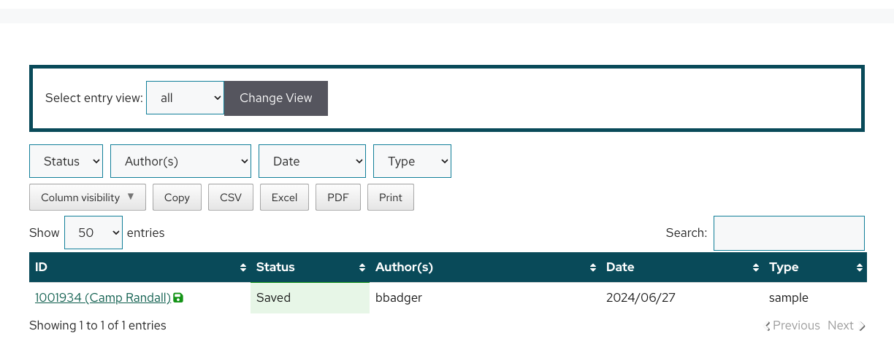

# My Data

While your [My Entries](https://discovery.tinyearth.wisc.edu/my-entries/) page is your one stop shop for creating entries, your "My Data" page is where you can:

- Perform an advanced search through entries you are an author or coauthor on
- Generate an excel or PDF report to turn into your instructor summarizing all your database work

To view your "My Data" page, click the "My Data" link in the navigation bar at the top of most [Discovery Database](https://discovery.tinyearth.wisc.edu/) pages.

!!! note ""
    

## Views

By default, your "My Data" table shows a small amount of general information about all of your entries, regardless of what type of entry they are. This can be useful when you need to confirm that your authorshop/coauthorship across all your entries is correct.

You can change the "Change View" dropdown to change what entry types should be the focus of your search.

!!! note ""
    

## Generating Excel and PDF Files

From time to time, your instructor may request that you export a summary of your work so far in the database, or you may find it helpful to have a record for other purposes.

To generate Excel or PDF files that you can share:

1. Select the view that best represents what you want to share, such as "aa-screen-library" if you need to summarize your library screening results
2. If needed, change the "Show __ entries" amount to show more or fewer entries of the selected type
3. If needed, filter the results using the view's available dropdown menus
4. Use the "Column visibility" dropdown to change which columns you want to include in your Excel or PDF, such as selecting everything but the ID, Authors, and Sample ID
5. Confirm that all information you need to share is shown on your screen
6. Click the Excel, PDF, and/or Print buttons to export the displayed information in the format you need

Now that you know how to search through your database entries in more advanced ways and how to export files you can share, recall that science is collaborative, and the research you are conducting in this course can be built on by others! Next, let's talk about entry Front Pages, which show all entries that refer to them, even those by students in other classes!
