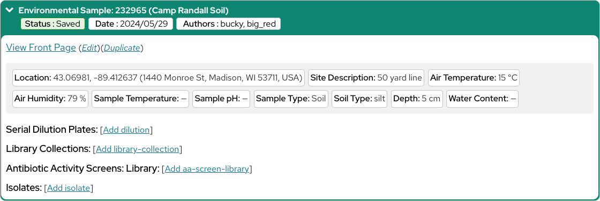

# My Entries

The "My Entries" page is your one stop shop for all entries you could want to add to the Discovery Database and to see the relationships between them.

And now that you've added your first Environmental Sample, when you return to your "My Entries" page, you should now see your Sample list, as a green box that can be expanded.

Within your Sample's box, you can see the information you recorded, as well as a number of actions you can take:

- View the entry's "Front Page," which we will talk about later in this workshop
- Edit the entry's details
- Create a duplicate of the entry for when you need a new entry similar to an old one
- And add new, different kinds of entries that reference this entry, such as Serial Dilution Plates and Isolates. More information about the various types of database entries are described in the "Entry Types" section of this workshop

As you create additional entries and return to this page, you will notice that the boxes shown expand to illustrate which entries "contain," or are referenced by, which other entries. This can help you locate entries you are working with and visualize their relationships.

You may have also noticed several green "Status : Saved" tags on each of your entries. So, next let's talk about the different statuses entries can have and how they fit into the flow of your Tiny Earth course!