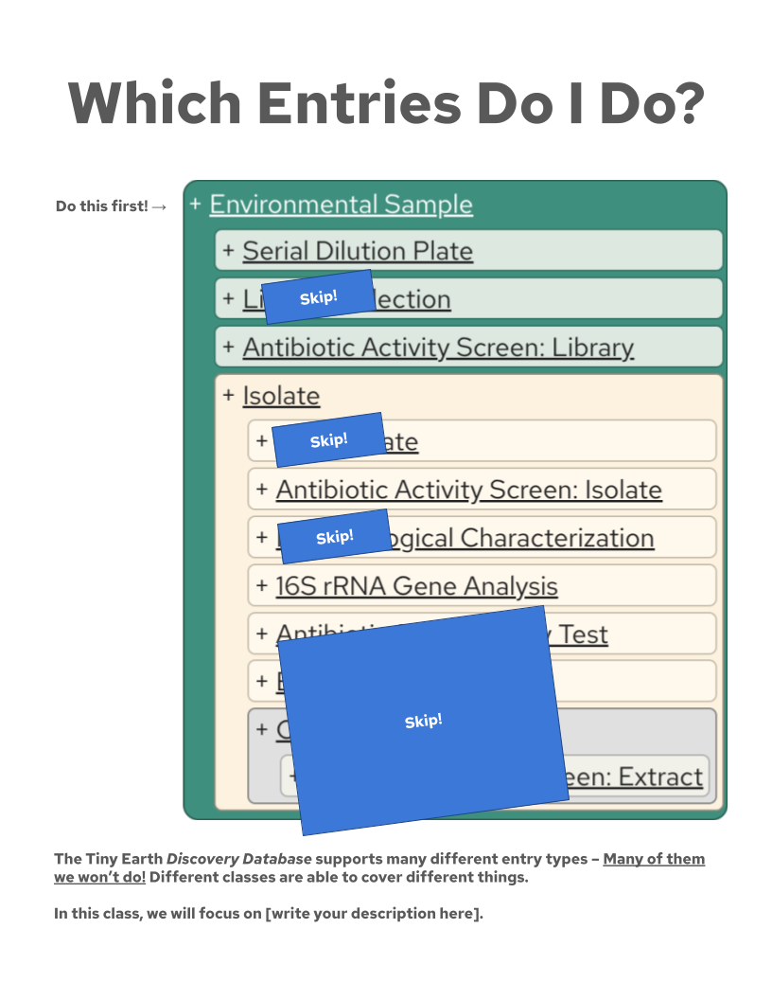

# Teaching with the Database

Now that you know how to add students to your course, it is time to instruct them on how to begin.

On this page, we provide some practical advice for including the database in your course plans, as well as example activity prompts and illustrations that you can adapt for your own needs.

## Creating Accounts

Before students can enter data, they will need to create accounts and be added to the classroom.

To help your students at this step, we recommend assigning them the following pages of this guide:

- [The introduction](index.md)
- [Getting Started](register.md)

!!! details "Click to See Example: Creating Account Activity"
    You may share the following text with your students or adapt it to your needs:

    > In this course, we will be following the Tiny Earth research flow and recording our research as we go. In Lab, you will keep records in your own (paper) notebook and take photos using your own smartphone or camera device. Then outside of Lab, you will transfer that information to the Tiny Earth *Discovery Database*.
    >
    > **Activity:** To prepare us for that, all students will need to first create their database account. This activity is graded on completion and worth **(points here)** points.
    >
    > To begin, read the following sections of the *Discovery Database* guide:
    >
    > - [The introduction](index.md)
    > - [Getting Started](register.md)
    >
    > As you do, follow along with the instructions provided there.
    >
    > When you create your account, use Invitation Code **(your student invitation code here)** and use your school email address.
    >
    > Once you've received the activation link from the database to your school email address and clicked the link to finish creating your account, your account is almost ready -- now I need to link your account to our course.
    >
    > To notify me that your database account is ready, **(your communication preference here)**.

    If you do not have a valid Invitation Code to give your students, please contact <tinyearth@wid.wisc.edu>.

## First Entries

All Tiny Earth research flows begin with collecting an environmental sample.

To help your students at this step, we recommend assigning them the following pages of this guide:

- [Add Your First Entry](first-entry.md)

If your students will be working in groups, you may also want to assign:

- [Coauthors](coauthors.md)

And to provide them more detailed information about Environmental Sapmles, you may also want to assign:

- [Entry Types / Environmental Sample](entries/sample.md)

!!! details "Click to See Example: First Entry Activity"
    You may share the following text with your students or adapt it to your needs:

    > **Activity:** Now that you have collected your environmental samples, it is time to record their information in the *Discovery Database*. This activity is graded based on the following rubric, for a total of **(points here)** points:
    >
    > - Your Environmental Sample entry has a nickname that reflects where it was collected, what type of sample it is, and any applicable experimental conditions -- **(points here)** points
    > - Your Environmental Sample entry has an accurate date and location -- **(points here)** points
    > - Your Environmental Sample entry has **(other form information you want them to record here)** -- **(points here)** points
    > - In the Additional Notes field of your Environmental Sample entry, you record **(additional notes you want them to record here)** -- **(points here)** points
    > - You have all of the above for each Environmental Sample you collected -- **(points here)** points
    >
    > Once you've recieved feedback on this assignment, you may resubmit with revisions for a regrade once. This is allow you time to become comfortable with the database tool.
    >
    > To begin, read the following sections of the *Discovery Database* guide:
    >
    > - [Add Your First Entry](first-entry.md)
    > - [Coauthors](coauthors.md)
    > - [Entry Types / Environmental Sample](entries/sample.md)
    > As you do, follow along with the instructions provided there.

    To grade this assignment, you can [view your students' entries](viewing.md) and use the "sample" entry view. You may adjust the view to show more or less information to fit your needs, and you may click on a sample's ID to see it's Front Page quickly.

    It is important to use this first entry to build your students' good record-keeping habits early and to enculturate them to your record-keeping style and preferences.

## Other Entries

Every Tiny Earth course is its own: You have your own needs, lab capabilities, goals, objectives, and students, each with their own needs, capabilities, and goals.

Where you go from here depends on how you have structured your course to use the Tiny Earth research flow. We strongly recommend you familiarize yourself the database's [Entry Types](entries/index.md) and consider which you will (and will not) have your students record.

And before students record information beyond Environmental Samples, we recommend assigning them the following pages of this guide:

- [My Entries](my-entries.md)
- [Entry Statuses](status.md)
- [My Data](my-data.md)
- [Entry Front Pages](front-pages.md)
- Any relevant pages from [Entry Types](entries/index.md)

Finally, the concept of *not* entering every [Entry Type](entries/index.md) will likely be confusing to your students. You may want to share a graphic like the one below to help illustrate your course plans to your students. You can create your own version of this graphic for your own needs by [editing a copy in Google Slides](https://docs.google.com/presentation/d/1qWu7OuLz_dL_OMHg6j4YhC1aphp269NEQHtDUnSaokk/copy).

!!! note ""
    

Now that you've instructed your students how to begin, next you'll need to know how to view the entries they record!
